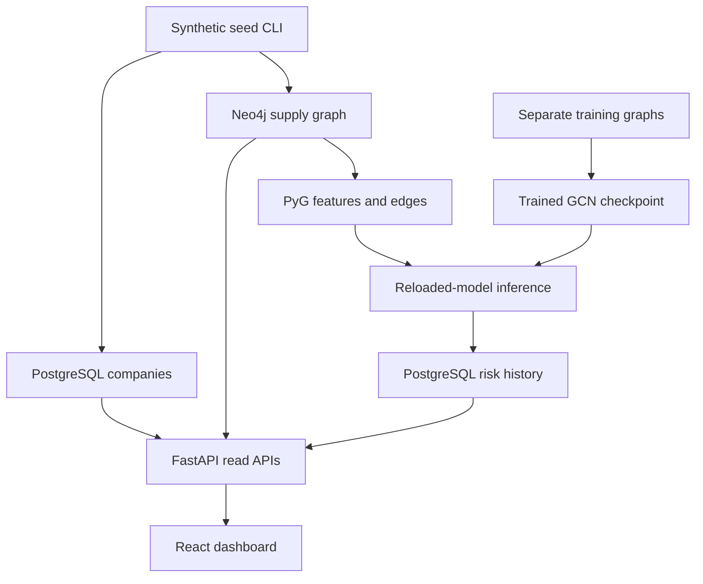

# Cascadence — Comprehensive project guide

**State through Phase 1 · 18 September 2026**

This guide explains what the project is, what has actually been built, how its pieces
work, how to operate them, what the verification establishes, and what remains.
`DATA_CONTRACT.md` remains authoritative for schemas; `PRD.md` remains authoritative
for product scope. `UPDATES.md` is the shorter handoff for a new coding session.

## 1. The project in plain language

Cascadence represents a company's supply network as connected companies. A relationship
says that one company supplies another, and a criticality weight describes how important
that relationship is. The eventual product will connect real news, filings, satellite
observations, maritime data, and nighttime lights to those companies. A graph neural
network will estimate risk using both a company's own evidence and its suppliers.

The wider product is intended to explain estimates, evaluate historical disruptions,
recommend alternative suppliers, simulate scenarios, issue alerts, and narrate evidence
into briefings. Those are the destination. The current deliverable is the first complete
synthetic-data path through the architecture.

**What works now:** generate a fictional network → store it → read it back → train a
GCN on other fictional networks → score the demo network → save scores with provenance →
serve companies, graph, and history → render the React dashboard.

This repository is the current graph-risk platform described by its PRD. Phase 1 does
not import an older shipment-delay XGBoost pipeline or claim that earlier project metrics
validate this GCN.

## 2. Scope and completion map

| Area | Current state |
|---|---|
| Phase 0 infrastructure | Existing completed foundation, preserved |
| Synthetic company generator | Implemented |
| PostgreSQL company/model/risk storage | Implemented, migrated |
| Neo4j Company and SUPPLIES graph | Implemented |
| Basic weighted GCN | Implemented, trained and evaluated on synthetic graphs |
| Model artifact reload and persisted inference | Implemented |
| Company list, graph, risk and risk-history APIs | Implemented |
| React dashboard and NetworkGraph | Implemented; automated component/build checks passed |
| Real signals / SEC / GDELT | Phase 2, not implemented |
| Satellite / AIS / VIIRS | Phase 3, not implemented |
| GAT / GraphSAGE / temporal models | Phase 4, not implemented |
| Explanations and historical backtests | Phase 5, not implemented |
| Scenario simulation, recommendations, alerts | Phase 6, not implemented |
| LLM briefings and public API productization | Phase 7, not implemented |
| Production deployment and demo video | Phase 8, not implemented |
| Auth/workspace ownership | Contract exists; implementation pending |

Phase 1 is implemented with passing automated checks. Full Docker Compose and visual
browser acceptance on the user's development machine are still outstanding. A green
remote GitHub Actions run has not been observed for these delivered files.

## 3. Architecture and responsibility boundaries

Cascadence is a modular monolith: one backend application with clearly separated service
modules. Celery shares the backend codebase for asynchronous work. This keeps the project
manageable without creating a distributed service for every feature.



| Component | Responsibility | Why it exists |
|---|---|---|
| FastAPI | Typed REST endpoints and error handling | Common interface for frontend and future clients |
| PostgreSQL | Company details, models, scores, timestamps | Relational integrity, history, and provenance |
| Neo4j | Company nodes and directed supply relationships | Multi-hop traversal of suppliers/customers |
| PyTorch Geometric | Graph tensors and GCN message passing | Learn from network dependencies |
| React + TanStack Query | Dashboard, fetch state, cached queries | Interactive exploration and consistent loading/errors |
| react-force-graph-2d | Canvas graph simulation/rendering | Visualize nodes, weights, and direction |
| Redis | Existing broker/cache infrastructure | Supports future task orchestration and pub/sub |
| Celery worker/beat | Existing background-job infrastructure | Worker executes tasks; beat schedules them |
| Prometheus/Grafana | Existing monitoring foundation | Collect and inspect service metrics |
| Docker Compose | Local multi-container runtime | Starts services with consistent networking |
| GitHub Actions | Automated checks on push/PR | Detect broken changes before integration |

The Phase 1 seed path is a synchronous CLI. Redis and Celery do not participate in its
training or inference run yet. A running worker is not evidence that a risk-refresh task
has been implemented.

## 4. What Phase 0 already established

The existing repository supplied FastAPI application boot, a `/health` liveness endpoint,
configuration loaded through Pydantic settings, database client wrappers, structured
logging, request correlation IDs, HTTP metrics, CORS, and an API router placeholder.

It also supplied React/Vite/TypeScript, TanStack Query setup, a frontend nginx image,
backend Docker image, Compose services, and an Alembic baseline revision. The initial
migration deliberately created no application tables.

The Compose service names are important: `postgres`, `neo4j`, `redis`, `backend`,
`celery_worker`, `celery_beat`, `frontend`, `prometheus`, and `grafana`. Containers use
those names to reach each other. `localhost` inside a container refers to that container;
your Windows host uses the published localhost ports instead.

The previous handoff records successful Compose health checks for Phase 0. Preserve the
worker's Celery ping healthcheck and the beat service's disabled inherited HTTP check.
A Celery process does not serve the backend's `/health` endpoint.

## 5. Synthetic network generation

Entry point: `backend/app/services/ingestion/synthetic_generator.py`.

The default graph contains 60 companies and four tiers. Tier 0 is the focal company;
tier 1 supplies tier 0, tier 2 supplies tier 1, and tier 3 supplies tier 2. Every edge
points from the supplier toward its customer. This is a directed acyclic graph because
edges always move toward a lower tier.

Each supplier chooses customers from the preceding tier. Selection is weighted by
existing customer in-degree plus one, giving already-connected customers a greater
chance of receiving more suppliers. This is a simple preferential-attachment mechanism,
not a claim that the generated distribution exactly matches real supply chains.

Company names combine fictional prefixes/suffixes with an index. Industries and countries
come from bounded demo categories. Every company has `is_synthetic=True`.
Relationships contain a type, a criticality between 0.15 and 0.95, and a synthetic since
date. The requested average out-degree is approximate because candidate sets are bounded.

UUIDs are derived from a namespace plus generator version, seed, size, tier count,
requested degree, and company index. Consequently:

- Equal generator inputs reproduce IDs, company attributes, topology, and edge weights.
- Re-running the same inputs updates the same companies.
- Changing generator inputs creates a separate network rather than partly replacing one.
- Negative seeds are reserved for training/evaluation; the demo CLI requires nonnegative seeds.

Input validation limits networks to 1–1,000 companies and requested degree to 1–10.
The isolated-company case is explicitly supported with one company and one tier.

## 6. Persistence and identity

The added Alembic revision is `20260918_01`, following the original
`7fd68b6689ff` baseline. It creates three tables:

| Table | Stored meaning | Important safeguards |
|---|---|---|
| `companies` | Identity, name, optional ticker/CIK, industry, location, provenance | UUID primary key, unique Neo4j UUID link |
| `model_versions` | Architecture, training time, metrics, artifact path, active flag | Architecture enum; partial unique index permits at most one active model |
| `risk_scores` | Company/model association, score, time, snapshot identity | Foreign keys; score CHECK in [0,1]; company/time index |

The contract's other tables are still future specifications. In particular, there are
no `signals`, workspace, explanation, recommendation, or simulation tables in this
migration. Avoid assuming a table exists just because it appears in the PRD.

`companies.id`, `companies.neo4j_id`, and Neo4j `Company.uuid` carry the same UUID.
`neo4j_id` is a stable string link, not Neo4j's internal node identifier.
Neo4j enforces uniqueness on `Company.uuid`. Nodes hold graph-facing company properties;
relationships hold their specified type, criticality, and since date.

SQL writes use PostgreSQL upserts. Neo4j uses MERGE and replaces only relationships
whose two endpoints belong to the exact network being regenerated. It does not wipe
the database or delete unrelated networks.

### Failure and rerun behavior

PostgreSQL and Neo4j do not share a transaction. The seed CLI acquires a PostgreSQL
advisory lock, writes company rows, updates Neo4j transactionally, reads the persisted
graph, trains, saves artifacts, and finally stores scores.

If graph persistence fails, SQL company rows can exist without a graph projection or
scores. The API distinguishes these states. Rerunning the same command repairs the
projection. Model activation and all scores for a successful run commit together in one
SQL transaction. A failed artifact or score step can leave an unused artifact folder;
no score row claims that run succeeded. Future orchestration can add explicit run-state
tracking and cleanup; it is not simulated in Phase 1.

## 7. Graph-to-tensor conversion

`graph_builder.py` sorts company UUIDs to establish a stable tensor row order. The same
ordering maps model outputs back to company IDs. PyG receives:

| Tensor | Shape | Meaning |
|---|---|---|
| `x` | N × 8 | Six industry indicators, synthetic flag, local shock severity |
| `edge_index` | 2 × E | Supplier row index and customer row index |
| `edge_weight` | E | Relationship criticality |
| `edge_attr` | E × 5 | Criticality plus four relationship-type indicators |
| `node_ids` | N strings | Row-to-company lookup |

Unknown industries map to the explicit Other category. Empty edge sets retain shape
`[2,0]`. Empty, isolated, and disconnected graphs are covered by model tests.

The feature schema is versioned as `phase1-v1`. The basic GCN consumes criticality as
its message-passing weight. Relationship categories are retained for future architectures
but are not consumed by the basic GCN. No existing risk score or target is an input.

`build_pyg_graph(company_ids, scenario_seed)` currently operates on explicit company IDs.
The eventual workspace-based orchestration in the PRD cannot be implemented faithfully
until workspace ownership exists. This temporary signature is documented in the contract.

## 8. Synthetic shocks and training targets

Each company receives a reproducible local shock based on company UUID and a scenario
seed. With probability 0.25 it receives severity in [0.65,1]; otherwise the value is in
[0,0.12]. These are generated scenario inputs. They are saved in the snapshot artifact
and are never represented as real SEC, news, satellite, AIS, or VIIRS observations.

Training targets follow two rounds of a transparent synthetic supplier-propagation rule.
For company i, local shock s, supplier set S, and edge criticality c:

\[
r_i^{(0)} = s_i,\qquad
r_i^{(t+1)} = 1-(1-s_i)\prod_{j\in S(i)}(1-0.65c_{ji}r_j^{(t)}).
\]

An isolated company retains its local shock. A shocked supplier can increase customer
risk; a customer's shock does not propagate backward into the supplier. Zero shocks
produce zero targets. The rule is a source of toy labels, not the future interactive
scenario engine or a validated economic model.

The GCN is trained to approximate this rule. Targets are assigned to `data.y` only for
training/evaluation batches. Inference tensors contain features and edges without labels.
This separation avoids feeding the answer into the model.

## 9. The basic GCN

`GCNRiskModel` has two weighted `GCNConv` layers with 32 hidden channels and ReLU.
The second graph representation is concatenated with each node's original features,
then passed through a small MLP and sigmoid to produce one bounded score per company.
The local-feature connection helps retain a company's own shock after graph aggregation.
PyG supplies self-loops and normalization through GCNConv defaults.

Training uses Adam at learning rate 0.01 and mean squared error. CPU execution is the
default, with a fixed Torch seed and one Torch thread for this small workload. It does
not need CUDA, a GPU, paid APIs, or an LLM.

| Split | Graph seeds | Graphs | Nodes |
|---|---|---:|---:|
| Training | -1024 through -1001 | 24 | 1,440 |
| Validation | -2006 through -2001 | 6 | 360 |
| Test | -3006 through -3001 | 6 | 360 |
| Displayed demo | 42 by default | 1 | 60 |

The whole-graph split avoids sharing a graph across train/test partitions. Validation
MSE chooses the checkpoint. Test data are evaluated after selection. The same generator
and labeling rule underlie all splits; these results do not establish robustness to
real-world distribution changes.

The default 120-epoch run achieved test MAE 0.032107, against 0.323625 for a constant
predictor and 0.103487 for a local-shock-only predictor. See `PHASE1_VALIDATION.md` for
all metrics. Do not describe these results as real disruption accuracy, a calibrated
probability, or a backtest against COVID/Suez/chip-shortage events.

## 10. Inference, artifacts, and provenance

Inference reads the persisted Neo4j graph. It generates deterministic demo shocks,
builds PyG tensors, saves the selected model, reloads that checkpoint with
`weights_only=True`, checks feature-schema compatibility, and computes scores under
`torch.no_grad()`.

Each run writes:

```text
ml/training/artifacts/<new-model-UUID>/
  model.pt
  snapshot.json
  metrics.json
```

The snapshot records graph nodes, relationships, synthetic shocks, seed, and feature
schema. Its canonical serialized content is SHA-256 hashed; that hash is recorded in
risk rows. Thus an API score can be traced to a company, model, timestamp, and graph
snapshot. Model IDs and timestamps change each run even if the inputs reproduce the
same scores. A new model is marked active, and previous active models become inactive;
older risk rows remain available as history.

The default path is `../ml/training/artifacts` when running from `backend/`. Compose
sets `MODEL_ARTIFACT_DIR=/artifacts` and mounts the host artifacts directory there.
Artifacts are intentionally ignored by Git and generated by the seed command.
Moving an artifact tree between environments requires maintaining corresponding model
paths; portable model registry/storage is future work.

## 11. API behavior

All application endpoints use `/api/v1`. `/health` remains a separate liveness check.
It confirms the API process is running, not that all databases are healthy.

| Endpoint | Behavior |
|---|---|
| `GET /companies` | Paginated companies with latest score; exact industry filter and literal case-insensitive name/ticker search |
| `GET /graph/{company_id}` | Graph nodes and directed links within bounded reachability |
| `GET /risk/{company_id}` | Latest score plus newest 100 observations |
| `GET /risk/{company_id}/history` | Same history limit with optional inclusive timezone-aware `since` filter |

The company list is sorted by name then UUID, with page size 1–100. The UI requests
12 rows at a time and optionally sorts risk within that visible page. This is not a
global server-side risk ranking.

Graph depth is 1–5, default 2. Upstream follows incoming supplier edges; downstream
follows outgoing customer edges; both uses undirected reachability. Returned arrows
always retain supplier-to-customer direction. The selected company is included even
if isolated. All links among returned nodes are included. Stored tier values are
absolute generator tiers, not distance from the selected company.

A PostgreSQL window query finds latest scores; the API does not issue a separate SQL
query for every graph node. Risk history is newest first, with a UUID tie-breaker for
equal timestamps. A missing score is `null`, not a misleading zero.

| State | Response |
|---|---|
| Unknown company UUID | 404 |
| Company exists but graph projection is missing | 409, rerun guidance |
| Existing company has no scores | 200 with `latest:null`, `history:[]` |
| Invalid UUID/depth/query | 422 |
| More than 1,000 reachable nodes | 422, reduce depth |
| Data store failure | 503 with sanitized message |
| Non-development environment | 403 for Phase 1 read endpoints |
| Supplied workspace_id | 422 until workspace scoping exists |

Errors follow `{error:{code,message,details}}`, including FastAPI validation failures.
The application does not expose write/refresh endpoints before their workflows exist.

### Authentication boundary

The original data contract specifies JWT and API-key authentication. Phase 1 explicitly
permits unauthenticated reads only in development mode. It is not pretending to implement
users, memberships, or tenant isolation. Do not publicly deploy the demo by setting
production to development. Authentication and ownership checks must precede public use.

## 12. Frontend behavior

The `/` route redirects to `/dashboard`. The page includes a fictional-company notice,
filtered company count, visible network size, selected risk, directory, graph explorer,
and risk-history table. The selected UUID is kept in `?company=...`, enabling a direct
link to the focal graph. If absent, the first company in the current result page is used.

Each company selection drives independent graph and risk queries. Graph depth/direction
are part of the cache key. Requests use AbortSignal so superseded requests can be
cancelled. Loading, failed request, empty dataset, no filter matches, and no score are
separate visible states. Refresh refetches the current queries and does not request a
graph with an empty company ID.

`NetworkGraph` wraps react-force-graph-2d. Node color reflects score bands, the selected
company is larger, arrowheads show direction, and edge width reflects criticality.
Canvas hover labels and an expandable accessible company list support exploration.
The component measures available width with ResizeObserver and clones graph objects
before handing them to the force library, which mutates node coordinates and link ends.

Display bands are low below 0.40, moderate from 0.40 to below 0.70, and high at or above
0.70. These are presentation thresholds, not validated operational alert policies.
The history table records computed time, model identity, snapshot, and bounded risk.
No missing score is styled as low risk.

The existing nginx configuration forwards `/api/` to `backend:8000` in Compose. Local
Vite development forwards to `localhost:8000`. An optional `VITE_API_URL` can specify a
full API base including `/api/v1`; it is a frontend build-time variable, not a backend
Pydantic setting. Frontend types currently mirror the contract by hand; OpenAPI client
generation remains a useful future improvement.

## 13. Running on your Windows machine

Apply the complete-file delivery using `PHASE1_INSTALL.md`. Keep the existing `.env`.
From `C:\Users\Samarth\Desktop\cascadence`:

```powershell
docker compose --env-file .env -f infra/docker-compose.yml up -d --build
docker compose --env-file .env -f infra/docker-compose.yml exec backend alembic upgrade head
docker compose --env-file .env -f infra/docker-compose.yml exec backend python data/seed/seed_demo.py
```

The first command rebuilds changed images and starts the stack. The second applies the
new schema migration in the backend container. The third creates data, trains, scores,
and prints the result. Wait for each command to succeed before continuing.

Open the dashboard. Use the printed focal UUID as the company query parameter to view
the entire default network at depth 3. Re-run the seed to create a second history point;
press Refresh data to load it.

To change demo scale:

```powershell
docker compose --env-file .env -f infra/docker-compose.yml exec backend python data/seed/seed_demo.py --num-companies 100 --num-tiers 4 --seed 7 --epochs 120
```

This creates another network. It does not replace your seed-42 network. The generator's
demo size does not change the fixed 60-node training graphs, so much larger demo graphs
also test beyond the training topology size and should not be interpreted as validated.

### Local backend without Docker

Use Python 3.11, install `backend/requirements.txt`, and run from `backend/`. Configure
PostgreSQL/Neo4j/Redis hosts as localhost for externally running containers. Ensure the
same database credentials are available to the backend and Alembic. Then run:

```powershell
alembic upgrade head
python -m app.services.ingestion.seed
uvicorn app.main:app --reload
```

In a second terminal, from `frontend/`, use `npm ci` then `npm run dev`. The root `.env`
is not automatically loaded when the working directory is `backend/`; export the
variables or provide the appropriate local env file. Compose already supplies them.

## 14. Testing and CI, from first principles

A **workflow** is the YAML recipe in `.github/workflows/ci.yml`. A **job** is a group
of steps, such as backend checks or frontend checks. A **runner** is the temporary
machine that executes those commands. **Service containers** are databases started
alongside a job so integration tests can exercise real persistence.

The workflow triggers on pushes to main and on pull requests. Backend checks install
Python dependencies, lint with Ruff, check type consistency with mypy, apply Alembic
migrations, and run pytest with coverage. Frontend checks install from the lockfile,
lint, compile TypeScript, run component tests, and build browser assets. Docker builds
run after backend/frontend jobs pass.

This delivery changes CI to use `cascadence_test` for PostgreSQL and explicitly enables
integration tests. Local default pytest skips them so it cannot accidentally mutate
the normal demo database. To run integrations in your own Compose setup, create a
separate test database once:

```powershell
docker compose --env-file .env -f infra/docker-compose.yml exec postgres createdb -U cascadence cascadence_test
docker compose --env-file .env -f infra/docker-compose.yml exec -e POSTGRES_DB=cascadence_test backend alembic upgrade head
docker compose --env-file .env -f infra/docker-compose.yml exec -e POSTGRES_DB=cascadence_test -e CASCADENCE_TEST_INTEGRATION=1 backend pytest --cov=app
```

Use your configured database username if it differs. If the test database already
exists, skip `createdb`. Tests clean up their own deterministic Neo4j network IDs.
Do not set the test flag against a production/demo SQL database; the fixture requires
its name to end in `_test` as an additional guard.

Locally, 28 backend tests and six frontend tests passed. The backend integration run
used standalone Neo4j and PGlite; native PostgreSQL 16 and full Compose remain to be
verified in CI/on your machine. A component test mocks canvas rendering, so a passing
suite cannot establish that a real browser graph is visually correct. See the separate
verification report for exact checks and limits.

GitHub workflow configuration does not itself enable protected-branch rules. Requiring
CI before merge is a repository setting that still must be configured/verified by the
repository owner. This delivery does not push or change GitHub settings.

## 15. Troubleshooting

| Symptom | Likely cause | Next step |
|---|---|---|
| Dashboard has no companies | Migrations succeeded but seeding has not run | Run the seed command and Refresh data |
| API returns 503 | Database down, wrong credentials, or migration not applied | Check Compose logs, configuration, and `alembic current` |
| Graph returns 409 | SQL company exists but graph projection is missing | Re-run the same seed parameters |
| APIs return 403 | ENVIRONMENT is not development | For this local demo use the intended development config; implement auth before public deployment |
| Backend reports missing torch/PyG | Container was not rebuilt after requirements changed | Re-run Compose with `--build` |
| Seed script cannot be found | Old Compose file or incorrect execution directory | Apply the new mount definitions; execute the documented command |
| Worker marked unhealthy by HTTP probe | Celery inherited the backend check | Restore existing worker ping and beat-disabled healthchecks |
| Local Vite cannot reach API | Backend is not listening on localhost:8000 | Start backend or set a correct VITE_API_URL |
| Re-seed adds companies unexpectedly | Generator seed/size/tiers/degree changed | Use identical parameters for the same network |
| Integration tests skip | Explicit test flag not set | Use a dedicated test database and the documented flag |

Do not remove Docker volumes or downgrade a populated database as a routine fix.
The migration downgrade is destructive to Phase 1 tables and was tested only on test data.

## 16. Current engineering limits and next phases

The pipeline establishes integration and reproducibility, not real predictive validity.
Synthetic features are simple; the model is static; there is no temporal evidence,
company resolution against real names, historical backtest, or calibrated uncertainty.
The graph API is bounded for a small local demo, not optimized for commercial-scale graphs.
Artifact storage is local, and failed runs may require manual orphan cleanup.

Phase 2 should introduce Signal ORM/migrations, compliant SEC fetching, GDELT news,
normalization, entity/relation extraction, provenance, and conservative real/synthetic
merging. Do not label rule-based guesses as confirmed supplier facts. Decide ownership
and workspace authorization before tenant-specific ingestion/write endpoints.

Phase 3 adds curated facility imagery and activity proxies. Phase 4 introduces richer
architectures, real signal aggregation, architecture comparisons, and ablations.
Phase 5 establishes explanations and historical backtesting. Phase 6 builds the
separate deterministic scenario engine, recommendations, and alerts. Phase 7 adds
narration and API productization; Phase 8 delivers deployment and a reproducible demo.

The LLM boundary stays the same throughout: it narrates structured evidence after
computation. It does not generate risk scores or substitute confident prose for missing
signals, explanations, or historical evidence.

## 17. How to explain the work in an interview

An accurate current description is: “I built a synthetic end-to-end supply-network risk
prototype using PostgreSQL, Neo4j, PyTorch Geometric, FastAPI, and React. It generates
reproducible multi-tier networks, trains a weighted GCN on separate synthetic graphs,
persists model/version/snapshot provenance, and exposes an interactive network and risk
history dashboard. Real-source ingestion and historical validation are the next stages.”

The strongest current engineering evidence is the complete stored-data path, stable
identities, model artifact reload, explicit edge orientation, reproducible graph splits,
contract-driven APIs, idempotent reruns, and integration tests. Keep later-phase claims
separate until they are implemented and measured.
